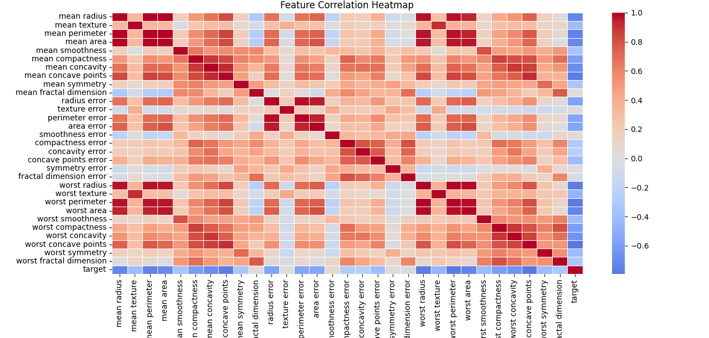

# Breast Cancer Detection - Logistic Regression

## Problem
Classify tumors as malignant or benign using the sklearn breast cancer dataset (569 samples, 30 features).

## Approach
- Standardized features using StandardScaler
- Split data 80/20 train/test with stratified sampling
- Trained a Logistic Regression classifier
- Evaluated with accuracy, confusion matrix, and classification report

## Results
- Accuracy: 98.24%
- Confusion Matrix: 2 misclassifications out of 114 test samples (1 false positive, 1 false negative)
- Precision/Recall: 0.98-0.99 across both classes

## Tech Stack
Python, Pandas, Scikit-learn, StandardScaler, Matplotlib, Seaborn

